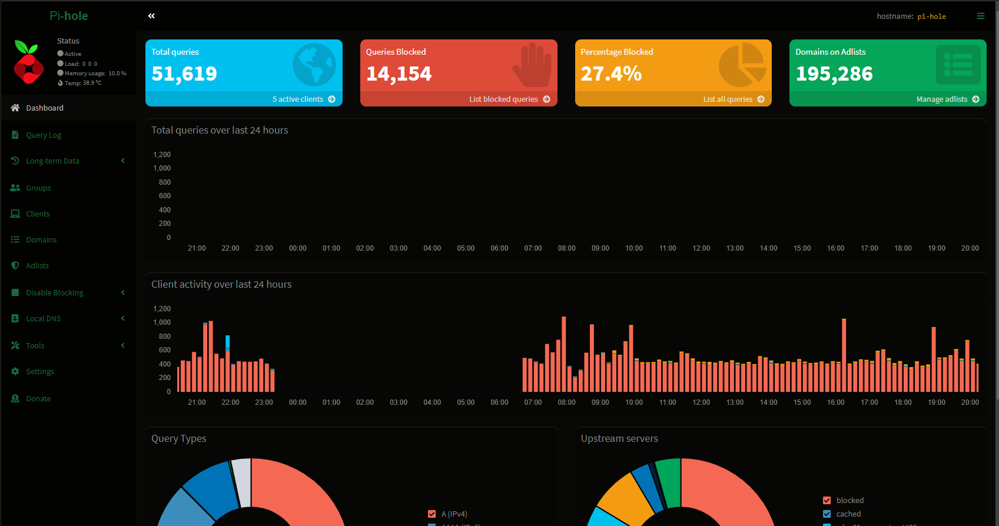
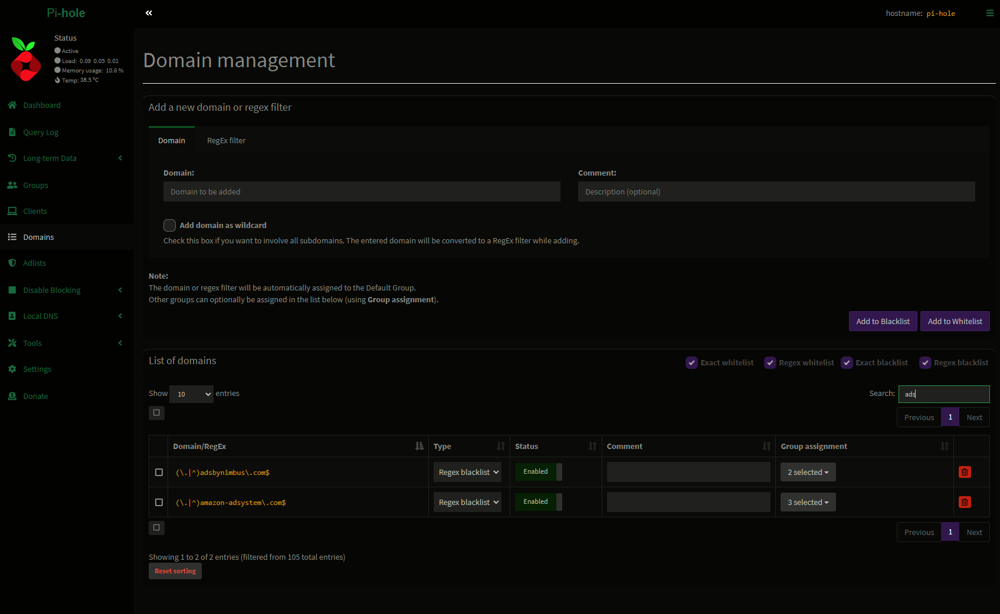
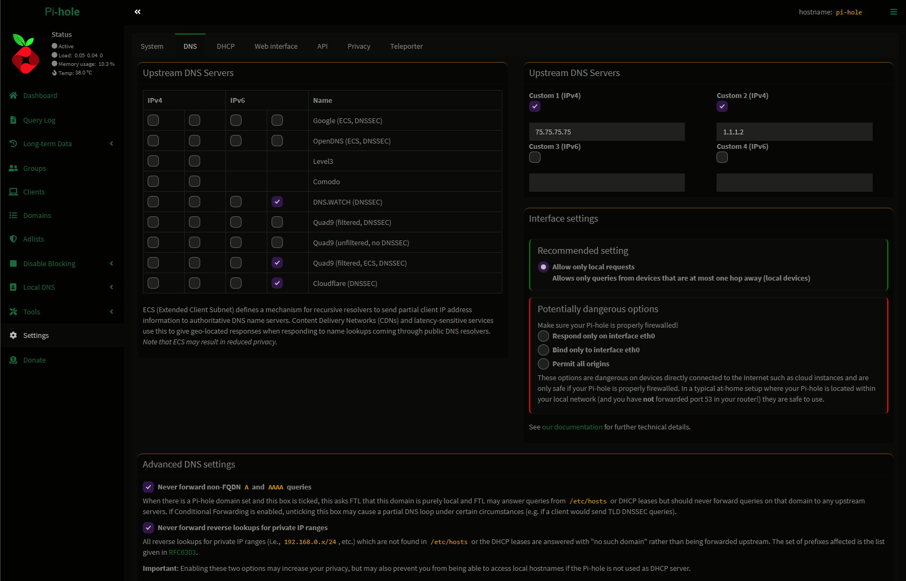

# pi-hole-themes
## Themes for pi-hole
### Current list of themes
- #### Darklee, A dark mode custom theme for pi-hole based on my themes for VSCode, Visual Studio and Chrome with the same name. 
---
## Installation
#### Replacing the deep-midnight theme.
#### You may need to adjust the commands below. 
- Backup the files that will be modified.
``` sh
    sudo cp -n /var/www/html/admin/style/themes/default-darker.css ~/
    sudo chmod 444 ~/default-darker.css
    sudo cp -n /var/www/html/admin/scripts/pi-hole/js/footer.js ~/
    sudo chmod 444 ~/footer.js
```

- Download the desired theme .css file to home directory.
- Replace the css in the pi-hole directory.
``` sh
    sudo cp ~/darklee.css /var/www/html/admin/style/themes/default-darker.css
```
- Optional update to the javascript for checkbox and radio button styling.
```
    sed -i.bk '/function/!s/ applyCheckboxRadioStyle/ \/\/applyCheckboxRadioStyle/g' /var/www/html/admin/scripts/pi-hole/js/footer.js
```
<br>

# Theme Screenshots

## Darklee
 <br><br>
 <br><br>
 <br><br>
## License
[MIT](./LICENSE)<br>
## Developer Information
**GitHub: [oQJamesQo](https://github.com/oQJamesQo)**
## Issues & Suggestions
Please use [GitHub issues](https://github.com/oQJamesQo/pi-hole-themes/issues) for issues and suggestions
